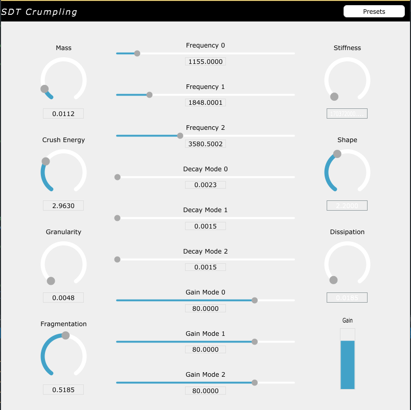
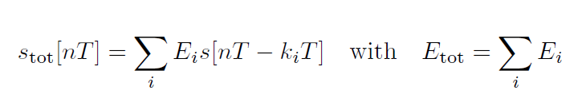
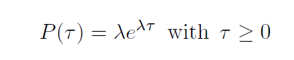
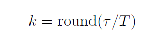

<!-- omit in toc -->
# Sound Design Toolkit - Crumpling Model VST3 Plugin
<!-- omit in toc -->
### A plugin realization of the crumpling model from the [Sound Design Toolkit](http://www.soundobject.org/SDT/) created with [JUCE](https://juce.com/)

<!-- omit in toc -->
## Contents
- [Introduction](#introduction)
- [Crumpling Model](#crumpling-model)
    - [Description](#description)
    - [Synthesis Algorithm](#synthesis-algorithm)
- [Crumpling Model Plugin](#impact-model-plugin)
    - [Software Architecture](#software-architecture)
 
## Introduction
The Sound Design Toolkit consists in a library of ecologically founded (e.g physics based) sound synthesis algorithms. The aim of the Sound Design Toolkitis to provide models in which we can control objective parameters directly.

In this project the entire SDT library is ported in C++ and integrated in the JUCE framework for the realization of a VST3 plugin version of the crumpling model.

## Software Architecture

## Crumpling Model

The crumpling model is a sound synthesis algorithm that produces sounds which occurs whenever the listener perceives an acoustic event whose source is interpreted as a superposition of microscopic crumpling events or impulses.
Such a model is based on the impact model, which defines the atomic events( i.e. impulses), on top of which stochastic series of micro-impacts are superimposed. The model is also controlled by the force of the crumpling process and the crumpling resistance.

The crumpling process consumes energy during its evolution. The process terminates when the transfer of energy does not take place any longer, i.e., when a reference energy, Etot, has been spent independently y each one of the impulses forming the event stot.

where s(nT) is a short discrete-time signal having unitary energy accounting for each single impulse.

Each time gap tau between two subsequent events in a temporal process is described by a Poisson distribution

Assuming a time step equal to T, then we simply map the time gap over a value defined in the discrete-time domain kT.

This is one possible description of the crumpling process in terms of its energy Etot, arrival times kiT and structure  s of each impulse.

We can synthetize the sound of each single impulse by assuming that the weighted superposition of only two “prototype” sounds accounts for all impulses once their pitch and loudness have been set. This prototype sound has empirically been obtained via modal synthesis, using the impact model.
